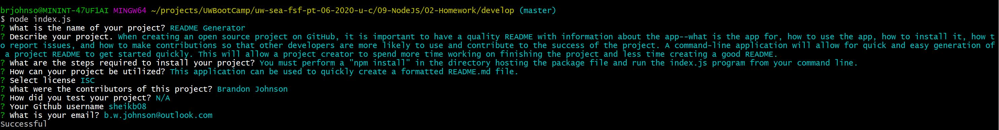

# README Generator

## Table of Contents
  - [README Generator](#readme-generator)
  - [Table of Contents](#table-of-contents)
  - [Description](#description)
  - [Installation](#installation)
  - [Usage](#usage)
  - [License](#license)
  - [Contributors](#contributors)
  - [Test](#test)

## Description
When creating an open source project on GitHub, it is important to have a quality README with information about the app--what is the app for, how to use the app, how to install it, how to report issues, and how to make contributions so that other developers are more likely to use and contribute to the success of the project. A command-line application will allow for quick and easy generation of a project README to get started quickly. This will allow a project creator to spend more time working on finishing the project and less time creating a good README.

## Installation 
You must perform a "npm install" in the directory hosting the package file and run the index.js program from your command line.

## Usage 
This application can be used to quickly create a formatted README.md file.

# Screenshots : 
|

## License
ISC

## Contributors
Brandon Johnson

## Test

Contact Information:
Github: https://github.com/sheikb08

